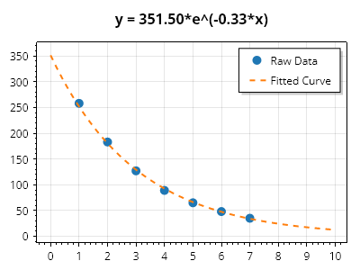

# Exponential Fit CSharp

Exponential fit code examples using C#

## Simple Curve Fitting

Exponential curves which pass through 0 can be described using two variables. Data can be translated from exponential into linear space, fitted using a linear least squares strategy, then the result translated back into exponential space.

## Advanced Exponential Curve Fitting

Exponential curves that do not pass through the origin are represented by equations containing 3 unknowns and cannot be fitted using a linear fitter. These advanced equations are best fitted using gradient descent or other methods which seek to minimize the error function. For more, see:

* [SwarmFit](https://github.com/swharden/SwarmFit) - A .NET package for fitting curves to X/Y data using particle swarm optimization

* [Linear Least Squares to Solve Nonlinear Problems](https://www.youtube.com/watch?v=jezAWd6GFRg) - A fantastic YouTube video describing how to use least squares strategy to fit nonlinear functions.

* [C# Helper](http://www.csharphelper.com/howtos/howto_exponential_curve_fit.html) - A legacy .NET WinForms app which uses gradient descent of the least squares error function to seek the best fit of an exponential curve

## Related

* [Exponential Fit with Python](https://swharden.com/blog/2020-09-24-python-exponential-fit/)